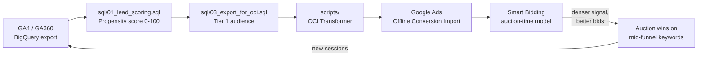

# Architecture

End-to-end data flow for the lead scoring and Smart Bidding feedback
loop. Each stage is independently testable.

## Table of Contents

- [Data Flow Diagram](#data-flow-diagram)
- [Stage 1: GA Export to BigQuery](#stage-1-ga-export-to-bigquery)
- [Stage 2: SQL Lead Scoring](#stage-2-sql-lead-scoring)
- [Stage 3: OCI Transformation](#stage-3-oci-transformation)
- [Stage 4: Google Ads Upload](#stage-4-google-ads-upload)
- [Stage 5: Smart Bidding Feedback Loop](#stage-5-smart-bidding-feedback-loop)
- [Failure Modes and Idempotency](#failure-modes-and-idempotency)

## Data Flow Diagram

The loop is intentional: every uploaded score becomes a training
signal, every winning bid creates a new session, and every new
session refreshes the underlying behavioral data on the next daily
run. The scoring model improves passively as the dataset grows.

## Stage 1: GA Export to BigQuery

The GA4 BigQuery export is the canonical source of truth. Each daily
partition arrives as `events_YYYYMMDD` (GA4) or `ga_sessions_YYYYMMDD`
(GA360, used here for the public sample dataset). No transformation
happens at this stage.

In production the export is configured once in the GA4 admin panel
and runs automatically. Latency is a few hours behind the visit, well
within the 24-hour window Google Ads requires for OCI freshness.

## Stage 2: SQL Lead Scoring

`sql/01_lead_scoring.sql` is the core model. It computes funnel-
weighted scores in a single CTE chain:

1. `sessions_base` flattens session-level totals.
2. `funnel_actions` counts e-commerce action types per session.
3. `product_breadth` measures how many distinct products the user touched.
4. `user_aggregates` rolls everything up to the visitor level.
5. `raw_scoring` applies capped feature contributions and weights.
6. `score_distribution` derives the min and max for normalization.
7. The final SELECT produces the 0-100 score, decile, and tier.

Every query is parameterized by `_TABLE_SUFFIX` so a backfill is a
one-line change.

## Stage 3: OCI Transformation

`scripts/src/lib/oci-transformer.ts` is a pure function: it takes a
`ScoredUserRow` and returns an `OciCsvRow`. No I/O, no mutable state.
This is the boundary where BigQuery semantics end and Google Ads
semantics begin.

Tier filtering happens at this stage rather than in SQL so that the
SQL output remains a single canonical scoring table that downstream
consumers (dashboards, audience exports, attribution analysis) can
use without re-running the model.

## Stage 4: Google Ads Upload

`scripts/src/lib/google-ads-uploader.ts` wraps the upload contract
with retry, exponential backoff, and a dry-run mode. The portfolio
build does not perform a live upload; it logs what it would have
sent. To go live, replace `performUpload()` with a call into the
`google-ads-api` Node client.

Uploads are idempotent in Google Ads: re-uploading the same
`(gclid, conversion_name, conversion_time)` triple has no effect.
That property lets the daily job be retried freely on transient
failure.

## Stage 5: Smart Bidding Feedback Loop

Once the scores arrive in Google Ads, Smart Bidding integrates them
into its auction-time model. The model learns that gclids tagged
"Predictive Lead Score - Tier 1" historically convert at a higher
rate than untagged ones, and it starts bidding more aggressively on
the keyword and audience combinations that produced them.

The feedback loop closes when winning auctions deliver new clicks,
which become new GA sessions, which feed the next day's scoring run.

## Failure Modes and Idempotency

| Failure                                | Behavior                                                                         |
| -------------------------------------- | -------------------------------------------------------------------------------- |
| BigQuery query timeout                 | Job fails fast; Cloud Scheduler retries on next interval.                        |
| Mock fixture missing                   | Pipeline throws at startup with the path printed to stderr.                      |
| OCI row malformed                      | Single row dropped, batch continues, count surfaced in the run summary.          |
| Google Ads API 5xx                     | Exponential backoff up to `maxRetries`, then the entire batch is recorded failed. |
| Duplicate upload (same daily run twice) | No effect; OCI dedupes on the `(gclid, name, time)` triple.                      |
